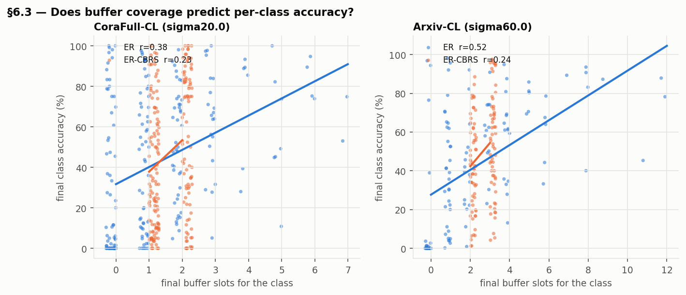

# Missing continual-learning baselines on DRIFT — results (protocol t2)

Mean ± std over seeds 1–3, CPU (DGL 1.1.2), fixed OMP_NUM_THREADS=2. Metrics recomputed from `results_t2/*.pkl` exactly as `metrics.tf_metrics`: A_AUC ↑ and AF_s = mean_k(final − peak) ↑ (≤ 0). **AF_s can be improved by underfitting (a task never learned has no peak to fall from): read it only with A_AUC.**

source: **paper** = DRIFT Table 2; **reproduced** = DRIFT method re-run here; **new** = added here. Paper numbers come from a different environment and are not directly comparable to rows run here (see NOTES.md, Gate 0).

## CoraFull-CL, Gaussian mixing, sigma20.0

| Method | A_AUC ↑ | AF_s ↑ | source |
|--------|---------|--------|--------|
| Bare | 21.9 ± 0.8 | -60.5 ± 7.3 | paper |
| Joint | 86.3 ± 0.1 | – | paper |
| A-GEM | 29.9 ± 2.8 | -53.9 ± 4.8 | paper |
| ER | 27.8 ± 0.6 | -48.0 ± 5.2 | paper |
| GSS | 29.3 ± 1.4 | -55.3 ± 0.1 | paper |
| MAS* | 29.8 ± 2.2 | -44.8 ± 8.0 | paper |
| SSM | 25.4 ± 2.2 | -58.4 ± 3.8 | paper |
| SEM | 27.5 ± 1.9 | -58.4 ± 2.6 | paper |
| DMSG | 34.1 ± 1.0 | -37.6 ± 3.5 | paper |
| A-GEM | 32.1 ± 0.7 (n=3) | -54.5 ± 2.7 | reproduced |
| Bare | 24.2 ± 0.4 (n=3) | -56.3 ± 7.3 | reproduced |
| CLS-ER (plastic_alpha=0.95, plastic_update_freq=1, reg_weight=0, stable_alpha=0.99444, stable_update_freq=0.9) | 38.5 ± 1.4 (n=3) | -25.2 ± 2.9 | new |
| CLS-ER (plastic_alpha=0.95, plastic_update_freq=1, reg_weight=0.1, stable_alpha=0.99444, stable_update_freq=0.9) | 38.6 ± 1.2 (n=3) | -22.9 ± 1.8 | new |
| DER (alpha=0.5) | 31.3 ± 0.9 (n=3) | -41.1 ± 5.4 | new |
| DER++ + CLS-ER (CBRS) (alpha=1, beta=0, ema_alpha=0.99444, ema_update_freq=0.9, gamma=0.1) | 39.0 ± 0.3 (n=3) | -21.4 ± 2.1 | new |
| DER++ + CLS-ER (CBRS) (alpha=1, beta=0.5, ema_alpha=0.99444, ema_update_freq=0.9, gamma=0) | 38.1 ± 1.3 (n=3) | -20.4 ± 2.7 | new |
| DER++ + CLS-ER (CBRS) (alpha=1, beta=0.5, ema_alpha=0.99444, ema_update_freq=0.9, gamma=0.1) | 37.1 ± 0.9 (n=3) | -21.5 ± 1.3 | new |
| DER++ (alpha=0.5, beta=1) | 33.7 ± 1.0 (n=3) | -39.4 ± 3.0 | new |
| DMSG | 34.6 ± 0.7 (n=3) | -32.8 ± 4.4 | reproduced |
| ER | 32.8 ± 1.0 (n=3) | -42.4 ± 2.0 | reproduced |
| ER-CBRS | 33.3 ± 1.0 (n=3) | -47.3 ± 5.4 | new |
| LwF-online (T=2, lambda_dist=10, update_every=100) | 38.0 ± 1.9 (n=3) | -24.3 ± 2.0 | new |
| PDGNN [SGC] | 35.4 ± 1.2 (n=3) | -33.4 ± 4.2 | new |
| MAS* | 29.7 ± 0.6 (n=3) | -47.0 ± 8.7 | reproduced |

## Arxiv-CL, Gaussian mixing, sigma60.0

| Method | A_AUC ↑ | AF_s ↑ | source |
|--------|---------|--------|--------|
| Bare | 18.5 ± 1.5 | -65.4 ± 3.1 | paper |
| Joint | 71.6 ± 1.4 | – | paper |
| A-GEM | 34.1 ± 1.4 | -48.6 ± 4.4 | paper |
| ER | 34.9 ± 0.8 | -37.3 ± 2.8 | paper |
| GSS | 24.2 ± 3.2 | -60.4 ± 5.6 | paper |
| MAS* | 38.4 ± 2.1 | -22.2 ± 1.8 | paper |
| SSM | 28.0 ± 4.3 | -64.5 ± 1.9 | paper |
| SEM | 26.8 ± 1.0 | -59.7 ± 6.9 | paper |
| DMSG | 31.6 ± 0.9 | -31.9 ± 2.9 | paper |
| A-GEM | 33.5 ± 1.6 (n=3) | -50.3 ± 6.2 | reproduced |
| Bare | 22.2 ± 1.8 (n=3) | -63.1 ± 4.9 | reproduced |
| CLS-ER (plastic_alpha=0.99, plastic_update_freq=1, reg_weight=0, stable_alpha=0.99, stable_update_freq=0.9) | 36.4 ± 1.8 (n=3) | -36.0 ± 2.2 | new |
| CLS-ER (plastic_alpha=0.99, plastic_update_freq=1, reg_weight=1.25, stable_alpha=0.99, stable_update_freq=0.9) | 37.2 ± 0.4 (n=3) | -32.9 ± 1.2 | new |
| DER (alpha=1) | 41.3 ± 0.8 (n=3) | -26.9 ± 3.0 | new |
| DER++ + CLS-ER (CBRS) (alpha=0.5, beta=0, ema_alpha=0.99, ema_update_freq=0.9, gamma=1.25) | 33.9 ± 1.0 (n=3) | -38.5 ± 1.5 | new |
| DER++ + CLS-ER (CBRS) (alpha=0.5, beta=0.5, ema_alpha=0.99, ema_update_freq=0.9, gamma=0) | 32.3 ± 1.7 (n=3) | -41.5 ± 1.9 | new |
| DER++ + CLS-ER (CBRS) (alpha=0.5, beta=0.5, ema_alpha=0.99, ema_update_freq=0.9, gamma=1.25) | 31.8 ± 1.5 (n=3) | -39.0 ± 2.1 | new |
| DER++ (alpha=0.5, beta=0.5) | 37.4 ± 0.8 (n=3) | -37.3 ± 0.6 | new |
| DMSG | 32.3 ± 1.6 (n=3) | -29.5 ± 2.5 | reproduced |
| ER | 35.6 ± 1.7 (n=3) | -38.0 ± 0.8 | reproduced |
| ER-CBRS | 30.2 ± 1.2 (n=3) | -41.7 ± 3.2 | new |
| LwF-online (T=20, lambda_dist=10, update_every=100) | 39.9 ± 2.5 (n=3) | -41.6 ± 3.2 | new |
| PDGNN [SGC] | 34.5 ± 1.3 (n=3) | -41.9 ± 0.3 | new |
| MAS* | 42.6 ± 1.1 (n=3) | -14.3 ± 2.1 | reproduced |

## Memory beyond the backbone (spec §2)

buffer_bytes: node id + label per slot, plus stored logits (DER family) or embeddings (PDGNN). extra params: parameter copies a method keeps (EMA models, teacher, importance weights, discriminator). Replay graphs are materialised from dataset.graph at replay time and are not counted.

| dataset | method | backbone | buffer bytes | extra params | extra param bytes | total bytes |
|---|---|---|---|---|---|---|
| Arxiv-CL | bare | GCN | 0 | 0 | 0 | 0 |
| Arxiv-CL | agem | GCN | 1,600 | 0 | 0 | 1,600 |
| Arxiv-CL | er | GCN | 1,600 | 0 | 0 | 1,600 |
| Arxiv-CL | er_cbrs | GCN | 1,600 | 0 | 0 | 1,600 |
| Arxiv-CL | der_alpha1.0 | GCN | 17,600 | 0 | 0 | 17,600 |
| Arxiv-CL | derpp_alpha0.5_beta0.5 | GCN | 17,600 | 0 | 0 | 17,600 |
| Arxiv-CL | pdgnn | SGC | 52,800 | 0 | 0 | 52,800 |
| Arxiv-CL | dmsg | GCN | 1,600 | 16,513 | 66,052 | 67,652 |
| Arxiv-CL | lwf_online_T20.0_lambda_dist10.0_update_every100.0 | GCN | 0 | 43,008 | 172,032 | 172,032 |
| Arxiv-CL | dercls_alpha0.5_beta0.0_ema_alpha0.99_ema_update_freq0.9_gamma1.25 | GCN | 17,600 | 43,008 | 172,032 | 189,632 |
| Arxiv-CL | dercls_alpha0.5_beta0.5_ema_alpha0.99_ema_update_freq0.9_gamma0.0 | GCN | 17,600 | 43,008 | 172,032 | 189,632 |
| Arxiv-CL | dercls_alpha0.5_beta0.5_ema_alpha0.99_ema_update_freq0.9_gamma1.25 | GCN | 17,600 | 43,008 | 172,032 | 189,632 |
| Arxiv-CL | tfmas | GCN | 0 | 86,016 | 344,064 | 344,064 |
| Arxiv-CL | clser_plastic_alpha0.99_plastic_update_freq1.0_reg_weight0.0_stable_alpha0.99_stable_update_freq0.9 | GCN | 1,600 | 86,016 | 344,064 | 345,664 |
| Arxiv-CL | clser_plastic_alpha0.99_plastic_update_freq1.0_reg_weight1.25_stable_alpha0.99_stable_update_freq0.9 | GCN | 1,600 | 86,016 | 344,064 | 345,664 |
| CoraFull-CL | bare | GCN | 0 | 0 | 0 | 0 |
| CoraFull-CL | agem | GCN | 1,600 | 0 | 0 | 1,600 |
| CoraFull-CL | er | GCN | 1,600 | 0 | 0 | 1,600 |
| CoraFull-CL | er_cbrs | GCN | 1,600 | 0 | 0 | 1,600 |
| CoraFull-CL | der_alpha0.5 | GCN | 29,600 | 0 | 0 | 29,600 |
| CoraFull-CL | derpp_alpha0.5_beta1.0 | GCN | 29,600 | 0 | 0 | 29,600 |
| CoraFull-CL | dmsg | GCN | 1,600 | 16,513 | 66,052 | 67,652 |
| CoraFull-CL | pdgnn | SGC | 3,485,600 | 0 | 0 | 3,485,600 |
| CoraFull-CL | lwf_online_T2.0_lambda_dist10.0_update_every100.0 | GCN | 0 | 2,247,680 | 8,990,720 | 8,990,720 |
| CoraFull-CL | dercls_alpha1.0_beta0.0_ema_alpha0.99444_ema_update_freq0.9_gamma0.1 | GCN | 29,600 | 2,247,680 | 8,990,720 | 9,020,320 |
| CoraFull-CL | dercls_alpha1.0_beta0.5_ema_alpha0.99444_ema_update_freq0.9_gamma0.0 | GCN | 29,600 | 2,247,680 | 8,990,720 | 9,020,320 |
| CoraFull-CL | dercls_alpha1.0_beta0.5_ema_alpha0.99444_ema_update_freq0.9_gamma0.1 | GCN | 29,600 | 2,247,680 | 8,990,720 | 9,020,320 |
| CoraFull-CL | tfmas | GCN | 0 | 4,495,360 | 17,981,440 | 17,981,440 |
| CoraFull-CL | clser_plastic_alpha0.95_plastic_update_freq1.0_reg_weight0.0_stable_alpha0.99444_stable_update_freq0.9 | GCN | 1,600 | 4,495,360 | 17,981,440 | 17,983,040 |
| CoraFull-CL | clser_plastic_alpha0.95_plastic_update_freq1.0_reg_weight0.1_stable_alpha0.99444_stable_update_freq0.9 | GCN | 1,600 | 4,495,360 | 17,981,440 | 17,983,040 |

## CoraFull-CL across transition regimes (A_AUC ↑ / AF_s ↑, seeds 1–3)

Each new method at its CoraFull Gaussian selection; the combination with all three terms. Non-Gaussian pipelines add evaluation points at task changes, so compare methods within a column, not across columns.

| Method | Gaussian σ=20 | boundary-local K=5 | global mixing 30% |
|---|---|---|---|
| Bare | 24.2 ± 0.4 / -56.3 ± 7.3 | 14.5 ± 1.2 / -76.9 ± 2.0 | 7.9 ± 0.4 / -72.9 ± 2.8 |
| ER | 32.8 ± 1.0 / -42.4 ± 2.0 | 38.6 ± 1.0 / -37.2 ± 1.8 | 28.2 ± 0.4 / -40.3 ± 2.6 |
| A-GEM | 32.1 ± 0.7 / -54.5 ± 2.7 | 27.8 ± 3.1 / -59.4 ± 8.3 | 15.9 ± 1.0 / -59.9 ± 1.9 |
| MAS* | 29.7 ± 0.6 / -47.0 ± 8.7 | 23.2 ± 2.4 / -65.8 ± 7.0 | 7.9 ± 0.4 / -72.9 ± 2.8 |
| DMSG | 34.6 ± 0.7 / -32.8 ± 4.4 | 40.4 ± 1.0 / -25.7 ± 1.0 | 35.0 ± 1.3 / -26.0 ± 2.9 |
| ER-CBRS | 33.3 ± 1.0 / -47.3 ± 5.4 | 39.1 ± 0.7 / -35.8 ± 6.1 | 28.4 ± 0.7 / -44.3 ± 0.7 |
| DER | 31.3 ± 0.9 / -41.1 ± 5.4 | 30.4 ± 0.6 / -56.2 ± 9.0 | 8.3 ± 0.5 / -71.0 ± 3.6 |
| DER++ | 33.7 ± 1.0 / -39.4 ± 3.0 | 39.2 ± 0.8 / -37.5 ± 3.1 | 27.3 ± 0.7 / -45.0 ± 2.9 |
| PDGNN | 35.4 ± 1.2 / -33.4 ± 4.2 | 35.4 ± 0.5 / -42.2 ± 1.7 | 34.3 ± 1.0 / -37.9 ± 0.2 |
| LwF-online | 38.0 ± 1.9 / -24.3 ± 2.0 | 19.6 ± 0.8 / -62.2 ± 2.1 | 6.1 ± 0.2 / -73.1 ± 0.7 |
| CLS-ER | 38.6 ± 1.2 / -22.9 ± 1.8 | 37.8 ± 0.4 / -18.3 ± 2.4 | 38.6 ± 0.7 / -16.5 ± 1.5 |
| DER++ + CLS-ER (CBRS) | 37.1 ± 0.9 / -21.5 ± 1.3 | 41.2 ± 0.6 / -10.9 ± 2.1 | 46.8 ± 1.8 / -17.7 ± 2.5 |

## Where the EMA methods' gains come from (spec §5.5 / §5.7 ablations)

A_AUC of each model the method keeps, evaluated at the same checkpoints (seeds 1–3). "inference (EMA)" is the reported number; "working" is the trained network. If removing the consistency term leaves the EMA number unchanged, the gain comes from evaluating an averaged model, not from the regulariser.

| dataset | method | variant | model | A_AUC | n |
|---|---|---|---|---|---|
| Arxiv-CL | CLS-ER | consistency removed (reg_weight=0) | inference (EMA) | 36.4 ± 1.8 | 3 |
| Arxiv-CL | CLS-ER | consistency removed (reg_weight=0) | plastic | 36.4 ± 1.8 | 3 |
| Arxiv-CL | CLS-ER | consistency removed (reg_weight=0) | working | 35.9 ± 1.6 | 3 |
| Arxiv-CL | CLS-ER | with consistency | inference (EMA) | 37.2 ± 0.4 | 3 |
| Arxiv-CL | CLS-ER | with consistency | plastic | 37.3 ± 0.4 | 3 |
| Arxiv-CL | CLS-ER | with consistency | working | 37.6 ± 0.5 | 3 |
| Arxiv-CL | DER++ + CLS-ER (CBRS) | beta only (no EMA term) | inference (EMA) | 32.3 ± 1.7 | 3 |
| Arxiv-CL | DER++ + CLS-ER (CBRS) | beta only (no EMA term) | working | 31.7 ± 1.6 | 3 |
| Arxiv-CL | DER++ + CLS-ER (CBRS) | both | inference (EMA) | 31.8 ± 1.5 | 3 |
| Arxiv-CL | DER++ + CLS-ER (CBRS) | both | working | 31.6 ± 1.6 | 3 |
| Arxiv-CL | DER++ + CLS-ER (CBRS) | gamma only (no stored logits) | inference (EMA) | 33.9 ± 1.0 | 3 |
| Arxiv-CL | DER++ + CLS-ER (CBRS) | gamma only (no stored logits) | working | 33.9 ± 0.8 | 3 |
| CoraFull-CL | CLS-ER | consistency removed (reg_weight=0) | inference (EMA) | 38.5 ± 1.4 | 3 |
| CoraFull-CL | CLS-ER | consistency removed (reg_weight=0) | plastic | 33.7 ± 1.4 | 3 |
| CoraFull-CL | CLS-ER | consistency removed (reg_weight=0) | working | 32.8 ± 1.2 | 3 |
| CoraFull-CL | CLS-ER | with consistency | inference (EMA) | 38.6 ± 1.2 | 3 |
| CoraFull-CL | CLS-ER | with consistency | plastic | 34.3 ± 1.0 | 3 |
| CoraFull-CL | CLS-ER | with consistency | working | 33.8 ± 0.9 | 3 |
| CoraFull-CL | DER++ + CLS-ER (CBRS) | beta only (no EMA term) | inference (EMA) | 38.1 ± 1.3 | 3 |
| CoraFull-CL | DER++ + CLS-ER (CBRS) | beta only (no EMA term) | working | 33.6 ± 1.4 | 3 |
| CoraFull-CL | DER++ + CLS-ER (CBRS) | both | inference (EMA) | 37.1 ± 0.9 | 3 |
| CoraFull-CL | DER++ + CLS-ER (CBRS) | both | working | 33.1 ± 1.1 | 3 |
| CoraFull-CL | DER++ + CLS-ER (CBRS) | gamma only (no stored logits) | inference (EMA) | 39.0 ± 0.3 | 3 |
| CoraFull-CL | DER++ + CLS-ER (CBRS) | gamma only (no stored logits) | working | 34.2 ± 1.2 | 3 |

## §6.3 Coverage diagnostic: final per-class accuracy vs final buffer slots

Seeds 1–3 pooled; one point per (class, seed). Pearson r and Spearman ρ over all points; "acc | 0 slots" vs "acc | ≥1 slot" compares classes the memory missed with classes it covered.

| dataset | method | points | Pearson r | Spearman ρ | classes with 0 slots (mean per seed) | acc at 0 slots | acc at ≥1 slot |
|---|---|---|---|---|---|---|---|
| CoraFull-CL | ER | 210 | 0.38 | 0.42 | 23.7 | 27.6 | 52.0 |
| CoraFull-CL | ER-CBRS | 210 | 0.23 | 0.22 | 0.0 | nan | 44.5 |
| Arxiv-CL | ER | 120 | 0.52 | 0.59 | 8.0 | 13.2 | 51.3 |
| Arxiv-CL | ER-CBRS | 120 | 0.24 | 0.22 | 0.0 | nan | 48.3 |

