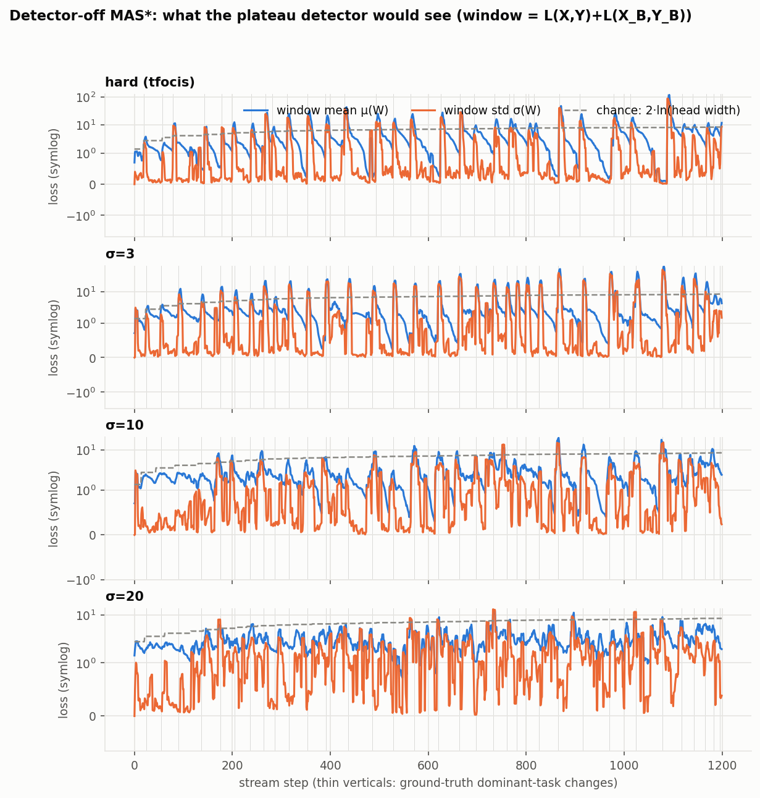
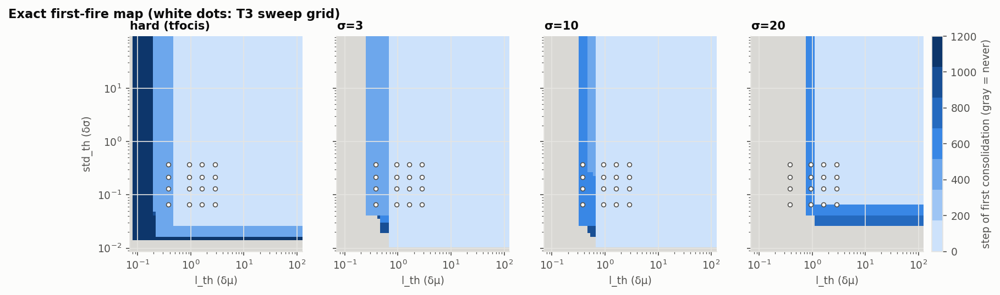

# MAS* threshold calibration — T1/T2

Source: detector-off `tfmas_star` traces (`l_th=-1`), seed 0, CoraFull-CL, GCN.

## Loss scale (steps with a full window and a buffer)

| regime | μ(W) p5 | p15 | p30 | p50 | σ(W) p5 | p15 | p30 | p50 | ln(head) final |
|---|---|---|---|---|---|---|---|---|---|
| hard (tfocis) | 0.378 | 0.94 | 1.62 | 2.86 | 0.0654 | 0.132 | 0.216 | 0.373 | 4.25 |
| σ=3 | 0.604 | 1.1 | 1.62 | 2.2 | 0.0532 | 0.103 | 0.167 | 0.401 | 4.25 |
| σ=10 | 0.673 | 1.16 | 1.66 | 2.22 | 0.0731 | 0.14 | 0.286 | 0.654 | 4.25 |
| σ=20 | 1.35 | 1.86 | 2.23 | 2.73 | 0.128 | 0.318 | 0.686 | 1.2 | 4.25 |

## T3 grid (percentiles of the hard-control trace) and offline first-fire step

| l_th | std_th | hard (tfocis) | σ=3 | σ=10 | σ=20 |
|---|---|---|---|---|---|
| 0.3779 | 0.06544 | 351 | 383 | 612 | never |
| 0.3779 | 0.1317 | 349 | 381 | 612 | never |
| 0.3779 | 0.2164 | 348 | 381 | 612 | never |
| 0.3779 | 0.3732 | 348 | 381 | 612 | never |
| 0.9404 | 0.06544 | 53 | 1 | 1 | 545 |
| 0.9404 | 0.1317 | 51 | 1 | 1 | 545 |
| 0.9404 | 0.2164 | 7 | 1 | 1 | 541 |
| 0.9404 | 0.3732 | 7 | 1 | 1 | 541 |
| 1.624 | 0.06544 | 37 | 1 | 1 | 527 |
| 1.624 | 0.1317 | 34 | 1 | 1 | 20 |
| 1.624 | 0.2164 | 5 | 1 | 1 | 20 |
| 1.624 | 0.3732 | 2 | 1 | 1 | 20 |
| 2.858 | 0.06544 | 37 | 1 | 1 | 527 |
| 2.858 | 0.1317 | 30 | 1 | 1 | 12 |
| 2.858 | 0.2164 | 5 | 1 | 1 | 12 |
| 2.858 | 0.3732 | 2 | 1 | 1 | 8 |

