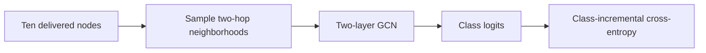
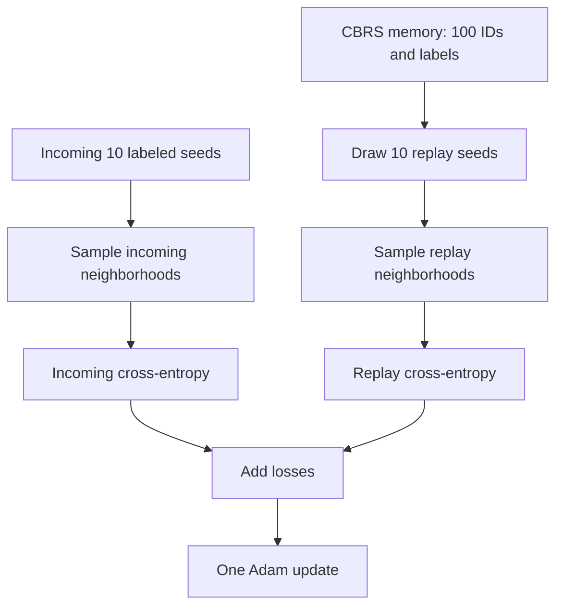
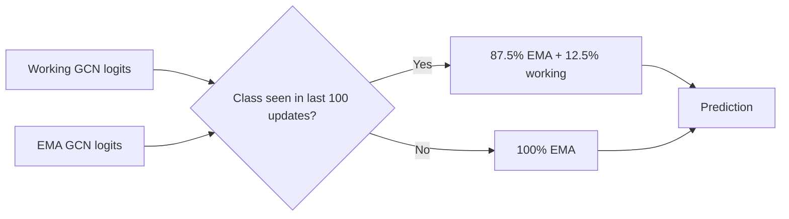
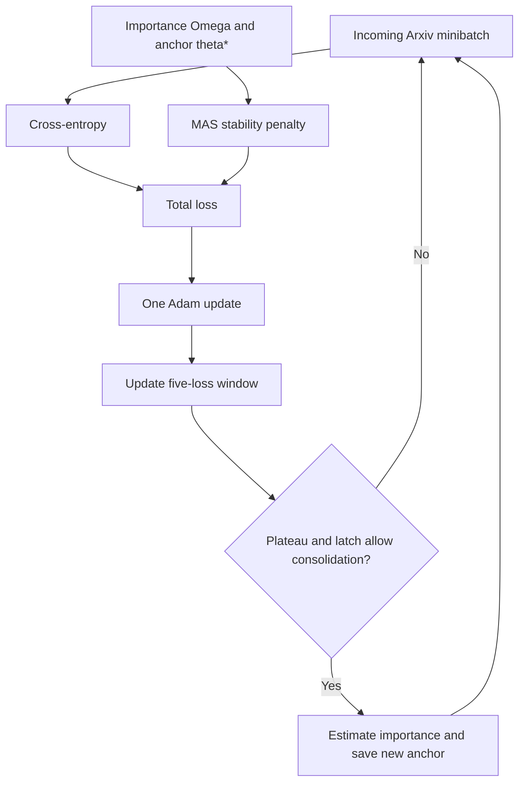

# How the dual-dataset models work

## Scope

The experiments did not produce one learning rule that worked best on both graph streams. They produced two frozen dataset-specific configurations:

- **CoraFull-CL uses H23:** contextual class-balanced replay, fixed classifier-row norms, an exponential moving average (EMA), and class-recency-gated inference.
- **Arxiv-CL uses H26:** the repository's task-free Memory Aware Synapses (MAS) learner without replay or classifier projection.

H23 is the final CoraFull configuration selected before test data were opened. H27 is a later Cora research candidate that adds partial synchronization of newly observed classifier rows. H27 is explained separately because it was developed after the frozen test and is not test-confirmed.

## Shared graph classifier

Both configurations use the benchmark's two-layer graph convolutional network. For a graph with normalized neighborhood aggregation \(\mathcal{A}\), node features \(X\), hidden weights \(W_1\), and classifier weights \(W_2\), the model can be summarized as

\[
H = \operatorname{ReLU}(\mathcal{A}(X)W_1),
\qquad
Z = \mathcal{A}(H)W_2.
\]

The rows of \(Z\) are node logits and its columns represent classes. Training uses sampled two-hop neighborhoods with fanouts `[10, 25]`. Each incoming minibatch contains ten labeled seed nodes. Neighborhood nodes supply features and topology, but their labels are not exposed unless those nodes are the delivered seeds.



## CoraFull H23

### Persistent state

H23 keeps the following state:

| State | Purpose | Size |
|---|---|---:|
| Working GCN | Receives gradient updates | Benchmark backbone |
| EMA GCN | Stable inference model | One backbone copy |
| CBRS replay memory | Stores node IDs and labels | 100 entries, 1,600 bytes |
| Class observation counts | Supports diagnostics and controlled losses | At most 70 integers |
| Class last-seen steps | Controls inference blending | At most 70 integers, 560 bytes |

The memory stores no node features, graph neighborhoods, logits, embeddings, task IDs, Gaussian weights, or future labels.

### 1. Incoming graph update

For incoming seed IDs \(B_t\), the learner samples their neighborhoods from the fixed transductive training graph. It computes ordinary class-incremental cross-entropy over classes observed so far:

\[
\mathcal{L}_{\text{new}}
=
-\frac{1}{|B_t|}\sum_{i\in B_t}
\log p_\theta(y_i\mid i).
\]

Task identity is not provided. The class head grows implicitly from the maximum label that has actually appeared in delivered data, following the benchmark's class-incremental evaluation convention.

### 2. Class-balanced replay with graph context

The class-balanced reservoir sampling (CBRS) memory prevents frequent classes from consuming all 100 slots. When memory is full and a sample from an underrepresented class arrives, it replaces an item belonging to a currently overrepresented class. Sampling for replay remains uniform over occupied slots.

Ten replay IDs are drawn for each ten-node incoming minibatch. Unlike the repository's original isolated-node replay, H23 samples real neighborhoods around those replay seeds from the same training graph:

\[
\mathcal{L}_{\text{replay}}
=
-\frac{1}{|R_t|}\sum_{i\in R_t}
\log p_\theta(y_i\mid \mathcal{N}(i)).
\]

The complete update is

\[
\mathcal{L}_t
=
\mathcal{L}_{\text{new}} + \mathcal{L}_{\text{replay}}.
\]

The model performs one Adam step. Context replay does more graph work than isolated replay, but it does not increase the number of stored or replayed labeled examples.



### 3. Fixed working-classifier geometry

Sequential streams can give recently active classifier rows larger norms, increasing their logits independently of directional quality. After each Adam update, H23 projects every working-classifier row to the mean row norm measured at initialization.

For classifier row \(w_c\) and fixed target norm \(r_0\),

\[
w_c \leftarrow r_0\frac{w_c}{\max(\lVert w_c\rVert_2,\epsilon)}.
\]

This changes no class prediction solely by applying one global temperature. Instead, it removes class-specific norm differences during subsequent training. It adds no parameters, labels, forward passes, or optimizer steps.

The EMA classifier is not projected. Experiments showed that unequal EMA shrinkage carries useful information about class age; projecting it reduced A_AUC.

### 4. Stable EMA model

After the optimizer and classifier projection, the inference network is updated with constant decay \(\alpha=0.995\):

\[
\bar\theta_t
=
0.995\,\bar\theta_{t-1}
+
0.005\,\theta_t.
\]

On the first update, the EMA is copied exactly from the working model. The EMA receives no gradients. It smooths the noisy one-pass training trajectory and supplies the stable logits used for old classes.

### 5. Class-recency-gated inference

A slow EMA preserves old knowledge but delays new knowledge. A global working/EMA blend improved A_AUC but increased forgetting. H23 therefore applies the working contribution only to recently delivered class columns.

Let \(s_c\) be the most recent update at which class \(c\) appeared, and let the current update be \(t\). The class is recent when

\[
t-s_c \le 100.
\]

For each class column, H23 constructs evaluation logits

\[
z_c^{\text{H23}}=
\begin{cases}
0.875\,z_c^{\text{EMA}} + 0.125\,z_c^{\text{working}},
& t-s_c\le100,\\
z_c^{\text{EMA}}, & \text{otherwise}.
\end{cases}
\]

This rule is task-free. It reads only the history of delivered labels. It does not know the Gaussian standard deviation, mixture weights, boundaries, current latent task, or evaluation labels. It adds one full GCN evaluation forward because both working and EMA logits are required.



### H23 pseudocode

```text
initialize working GCN theta
initialize EMA GCN theta_bar
initialize CBRS memory M with capacity 100
initialize last_seen[class]

for each ten-node stream minibatch B at update t:
    reveal labels only for B
    record last_seen[y] = t for delivered labels y

    sample incoming neighborhoods for B
    draw up to ten replay IDs R from M
    sample real graph neighborhoods for R

    loss = CE(working(B), labels(B))
    if R is non-empty:
        loss += CE(working(R), labels(R))

    perform one Adam update on loss
    project every working classifier row to fixed norm r0
    update CBRS memory with B

    if first update:
        theta_bar = theta
    else:
        theta_bar = 0.995 * theta_bar + 0.005 * theta

at evaluation:
    compute working and EMA logits
    for each class c:
        use 12.5% working logits only if t - last_seen[c] <= 100
    predict with the resulting class-wise logits
```

## CoraFull H27 research candidate

H27 retains every H23 component and adds one operation when a class is observed for the first time. After the ordinary EMA update, it moves that new class's EMA classifier row 5% toward the corresponding working row:

\[
\bar w_c \leftarrow 0.95\,\bar w_c + 0.05\,w_c.
\]

All encoder parameters, previously observed classifier rows, and later updates retain the ordinary 0.995 EMA rule. The mechanism attempts to reduce first-observation lag without globally destabilizing the EMA.

H27 achieved 43.69 A_AUC and -13.86 AF_s over four validation seeds. It improved acquisition consistently but did not meet the multi-seed forgetting target. Because it was designed after H23 test results were available, it is a research candidate rather than a test-confirmed result.

## Arxiv H26

### Why Arxiv uses a different learner

Arxiv has 10,172 stream updates, compared with 1,200 on CoraFull, and much longer class-pair spans. Directly transferring H23 produced severe forgetting. Scaling the EMA decay restored retention but made acquisition too slow. The existing task-free MAS learner gave the best validation balance without replay.

### MAS training loss

The working GCN first minimizes incoming class-incremental cross-entropy. After at least one consolidation event, MAS adds a parameter stability penalty:

\[
\mathcal{L}_t
=
\mathcal{L}_{\text{new}}
+
\frac{\lambda}{2}
\sum_j \Omega_j(\theta_j-\theta_j^*)^2.
\]

In the repository implementation, the effective MAS coefficient is 0.5. The vector \(\theta^*\) is the parameter anchor saved at the latest consolidation, and \(\Omega_j\) measures the estimated importance of parameter \(j\).

### Task-free consolidation detector

MAS keeps a rolling window of five training losses. A consolidation can occur when the loss mean and variance fall below fixed thresholds and the detector is not waiting for a new peak. A later loss increase releases the latch for another consolidation.

At consolidation, the learner:

1. computes gradients of the mean squared output logits on the current sampled block;
2. takes the absolute gradient of each parameter as a local importance estimate;
3. updates \(\Omega\) with a cumulative average;
4. copies the current parameters into \(\theta^*\).

No latent task boundary triggers this process. The detector uses only online training loss. H26 stores no replay examples and performs exactly one optimizer update per stream minibatch.



### H26 pseudocode

```text
initialize GCN parameters theta
initialize importance Omega = 0
initialize anchor theta_star
initialize rolling loss window of length 5

for each stream minibatch B:
    sample neighborhoods for B
    loss = CE(model(B), labels(B))

    if a consolidation has occurred:
        loss += 0.5 / 2 * sum(Omega[j] * (theta[j] - theta_star[j])^2)

    perform one Adam update
    append loss to the rolling window

    update the task-free plateau/peak detector
    if detector requests consolidation:
        estimate parameter importance from squared-output gradients
        cumulatively average the estimate into Omega
        theta_star = current theta

at evaluation:
    use the current working GCN directly
```

## Why several plausible components were excluded

| Component | Finding |
|---|---|
| Faster classifier learning | Reduced Cora A_AUC and worsened forgetting. |
| Global working/EMA blend | Improved acquisition but raised peaks that were not retained. |
| Full synchronization of new EMA rows | Improved AF_s but mismatched the working head with the EMA encoder. |
| EMA classifier normalization | Removed useful class-age information and reduced A_AUC. |
| Full replay neighborhoods | Added substantial graph work without improving A_AUC. |
| Degree-prioritized memory | Selected hubs with very large replay neighborhoods and reduced A_AUC. |
| Cora mechanism transferred to Arxiv | Failed because the stability timescale and acquisition behavior differ. |
| Fixed classifier norms on MAS | Catastrophically disrupted MAS optimization and consolidation. |
| Slow EMA over MAS | Greatly reduced forgetting but learned too slowly. |

## Metrics and interpretation

**A_AUC** is the mean pooled accuracy over all evaluation checkpoints. It rewards learning classes early, not only achieving high final accuracy.

**AF_s** is the signed mean difference between each task's final accuracy and its best earlier accuracy:

\[
AF_s = \frac{1}{K}\sum_{k=1}^{K}
\left(a_{k,\text{final}}-\max_t a_{k,t}\right).
\]

It is normally non-positive. A value closer to zero means less forgetting. AF_s must be read with A_AUC because a model that never learns a task can show artificially low forgetting.

## Results to associate with each configuration

| Configuration | Evaluation status | A_AUC | AF_s |
|---|---|---:|---:|
| Cora H23 | Frozen nine-run test aggregate | **44.25** | **-14.00** |
| Cora H27 | Four-seed validation aggregate, post-test research | **43.69** | **-13.86** |
| Arxiv H26 | Frozen three-run test aggregate | **42.23** | **-17.03** |

The targets were A_AUC above 42.75 and AF_s above -13.46. No frozen test configuration met both. H23 met the accuracy target, while retention remained the unresolved limitation.

## Source map

- Cora implementation and experimental controls: `Baselines/context_ema_model.py`
- Arxiv MAS measurement and EMA controls: `Baselines/mas_geometry_model.py`
- CBRS implementation: `Baselines/replay_buffers.py`
- Dual-dataset experiment harness: `experiments/scientific_gaussian.py`
- Scientific decision log: `analysis/gaussian_science/PLAN.md`
- Full results report: `analysis/gaussian_science/REPORT_DUAL_DATASET.md`
- Unit tests: `tests/test_context_ema.py` and `tests/test_mas_geometry.py`
